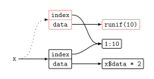
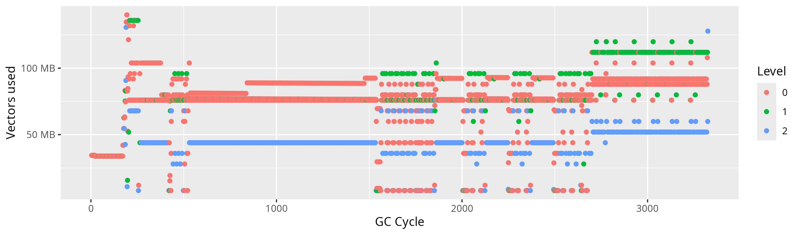
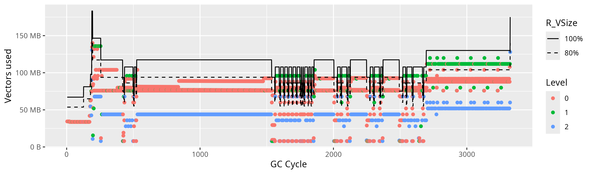

## Introduction

Recently I have been doing a lot of performance improvement work on
malariasimulation, a transmission model for malaria developed in the
department.

The general process to speed up the model involves running the simulation under
a profiler, finding spots that seem to consume a suspiciously excessive amount
of time and investigating these one by one. The solution to a given issue can
be as simple as [avoiding a copy of a vector][individual#190], or it can a bit
more involved and require [redesigning an algorithm to be more
efficient][individual#189].

After I'd found and fixed most of the low hanging fruits, I found myself with
profiles where a significant amount of the time was spent in the R language
runtime, doing garbage collection. While R may have a vague reputation of being
slow, spending 20% of time in garbage collection seemed excessive. Even
stanger, when collecting profiles inside of RStudio (instead of on the
command-line, through `Rscript`), the garbage collection time was closer to
30%. The time spent not in garbage collection on the other hand was roughly
constant.

Before we dive into the details of this issue, we need a bit of background on
memory management and garbage collection.

## A primer on memory management, garbage collection and the generational hypothesis

When a program runs on a computer, it uses memory to store information about
its work. The memory is seen as one long contiguous space, which gets divided
up into smaller chunks. When the program needs memory for something, it
allocates one of these chunks and assigns it for a given purpose. Once
allocated, the chunk cannot be used for another purpose.

Unfortunately, computers only have a finite amount of memory, therefore if the
program were to allocate chunks of memory forever it would quickly run out and
terminate[^OOM]. For this reason, it is important that programs deallocate chunks
they do not use anymore. Once a chunk has been deallocated, it can be re-used
for another purpose.

[^OOM]: What should happen when the system runs out of memory is a highly
    debated topic. Generally, on Linux, programs do not have the ability to
    handle this situation themselves, and the operating system may forcibly
    terminate any process, not necessarily the one who exhausted the memory. On
    Windows allocation of memory will fail and it is up to the program to cope
    with this. Most programs will either misbehave and crash, or simply
    terminate.

In some languages, such as C, it is the responsibility of the programmer to
release unused chunks of memory explicitly. Since this is generally cumbersome
and error-prone, many languages, including R, rely on a garbage collector to
accomplish this task. The garbage collector periodically inspects the state of
a program, figures out which chunks of memory can never be used in the future,
and deallocates them. The garbage collector operates behind the scenes, and
most of the time programmers are blissfully unaware of its existence.

Consider the small R program below. It creates a data frame with two columns
(one with values ranging from 1 to 10, the other full of random numbers) and
assigns it to the variable `x`. It then takes the `data` column, multiplies it
by 2 and assigns it back into `x`. This creates a new data frame, whose `data`
is the result of the multiplication[^copy-opt].

[^copy-opt]: In this simplified example, R actually optimizes the assignment to
    `x$data` and modifies the data frame in place. This is only allowed in a
    limited set of circumstances and is semantically *as-if* it had made a
    copy.

```r
x <- data.frame(index=1:10, data=runif(10))
x$data <- x$data * 2
```

We can represent the abstract state of the memory after executing these two
lines of code as a graph of variables and objects.

<p align="center">

</p>

The `x` variable on the left points to the new data frame created by the
modification. Meanwhile, nothing points to the old data frame at the top (the
old reference to it from `x` is dotted). We say the old data frame is
unreachable, and is effectively garbage. It wastes space in the memory but
could never be accessed again. Not only that, but there's a whole vector, the
original `data` column, that is also unreachable. On the other hand, the
original index vector is still reachable, through the new data frame.

The job of the garbage collector is to carefully figure out which chunks of
memory are reachable and which ones are not, and deallocate the ones which
aren't. It does so by traversing the memory, starting at the local variables
(here `x`), and following all the arrows until it runs out of objects to
visit.  After it does that, any object it hasn't visited (in red on the graph)
must be unreachable and can be deallocated. This process is commonly referred
to as *tracing* or *mark-and-sweep*[^refcount].

[^refcount]: There are other garbage collection techniques used in other
    languages.  The most common other one is reference counting, as used in
    Python for example.

In real programs, with millions of objects, traversing the entire memory can be
slow, and deciding how frequently to do it is a tradeoff between time spent on
garbage collection and the amount the garbage that temporarily accumulates. The
more often the garbage collector runs, the less garbage piles up and the less
memory is wasted, but the more time we spend collection garbage in total.

### Generational garbage collection

Garbage collection is a critical part of language design, and extensive
research has gone into trying to optimize this process and making garbage
collection more efficient. One empirical result of this research is the
"generational hypothesis": *most objects die young[^genhypo]*. This makes
intuitive sense: as programs make calculations, they produce a lot of
intermediate results that are only needed for a few more operations and then
become garbage.  Think for example of the vector that was returned by `runif`
in the earlier example. This means most of the garbage will be comprised of
relatively young objects.

[^genhypo]: Not all programs conform to this pattern. The litterature contains
    many alternative models for object lifetimes, often with fanciful names
    such as the *radioactive decay model* or the *bathtub model*.

Generational garbage collectors exploit this fact by dividing objects into
separate generations. The younger generations are traced frequently to avoid
accumulating a lot of garbage. The older generations may also contain garbage
(eg. a long lasting object finally became unreachable) but this happens
relatively infrequently, therefore we can get away with tracing those
generations more infrequently. When objects survive multiple rounds of garbage
collection, they are moved from a young generation to an older one.[^write-barrier]

[^write-barrier]: This description glosses over an important point: the write
    barrier. If a young generation object is only reachable from an old
    generation object, we would miss it when tracing the young generation only.
    I could not find much documentation about R's write barrier other than [one
    pretty superficial description][luke-barrier]. It is widely documented in
    the context of other languages that have a similar garbage collector, [such
    as Ruby][ruby-gc-write-barrier].

By following this principle, generational garbage collectors are able to reduce
the amount of tracing needed while minimizing the additional garbage overhead.
The details differ from one implementation to the next. In R there are three
generations, with generation 0 containing the youngest objects and generation 2
containing the oldest ones. After 20 collections at level 0 it performs a
collection at level 1, and after 5 of those it performs a collection at level
2.

This was a lot to process, but with this background knowledge we can now return
to our problem of garbage collection taking up too much time in our
malariasimulation.

## Malariasimulation

Lets recap our original issue with malariasimulation: looking at profiles of
where execution time is spent, about 20% of it is in the garbage collector.
When capturing the same profiles inside of RStudio, the number is closer to
30%.

Sampling profilers work by interrupting the process at regular intervals and
recording what the program was doing at the time. They are inherently
statistical, and may experience noise or bias. For instance, maybe some
interaction inside the R runtime makes it more likely for the samples to occur
during garbage collection. To rule this out we can measure the overall
execution time and garbage collection time, which we can get with `proc.time`
and `gc.time` respectively, and compare these without the use of the profiler.

```R
library(malariasimulation)

proc_start <- proc.time()[[3]]
gc_start <- gc.time()[[3]]

set.seed(123)
parameters <- get_parameters(list(human_population=1e6))
run_simulation(500, parameters)

proc_elapsed <- proc.time()[[3]] - proc_start
gc_elapsed <- gc.time()[[3]] - gc_start

cat(sprintf("Simulation: %.2fs GC: %.2fs Total: %.2fs Relative: %.2f%%\n",
            proc_elapsed - gc_elapsed,
            gc_elapsed,
            proc_elapsed,
            gc_elapsed / proc_elapsed * 100))
```

The code above runs the simulation for 500 timesteps (i.e. days), with a human
population of 1M people. The `proc.time` and `gc.time` functions both return a
vector with the "user", "system" and total time. The distinction between these
isn't very relevant here and we'll use the total time throughout.

We can run the script on the command line and see the results[^numberscaveats]:
```
$ Rscript gctime.R
Simulation: 55.22s GC: 17.03s Total: 72.25s Relative: 23.57%
```

[^numberscaveats]: The absolute numbers listed here need to be taken with a
    pinch of salt. They are the result of a single run, on a laptop whose CPU
    is subject to dynamic frequency scaling, and with other noisy programs
    running alongside. The general trends are nevertheless consistent and
    repeatable.

That pretty much confirms our observations from running under the profiler, and
will serve as a good way to experiment further. We also noticed previously that
when running the profiler inside of RStudio the effect was even worse. Let's
run our script and confirm that as well:
```
> source("gctime.R")
Simulation: 54.68s GC: 23.88s Total: 78.57s Relative: 30.40%
```

Again, this confirms our previous observations. Only the GC time increases in
any significant way, not the time spent on the actual simulation. This means
our model is generally not running any slower in RStudio than in the
command-line, instead it is only the garbage collector which takes more time.

Since garbage collection time is the sum of many small collection cycles, if
total collection time increases then either the garbage collection is more
frequent in RStudio or each collection cycle takes more time (or a combination
of both).

To figure out which it is, we can call the `gcinfo(TRUE)` function before
starting the simulation. When this flag is set, R will print information on
each collection cycle.

```R
gcinfo(TRUE)
source("gctime.R")
```

For each garbage collection cycle, R prints out a lot of information to the
console. For now we'll only focus on the last group of lines:
```
Garbage collection 3306 = 2388+410+508 (level 2) ...
29.2 Mbytes of cons cells used (51%)
122.0 Mbytes of vectors used (73%)
```

That's 3306 garbage collection cycles in total. R also print our memory usage,
broken down into "cons cells", which mostly represent code, and vectors, which
represent data. Now lets run the same in RStudio to compare:

```
Garbage collection 2542 = 1558+483+501 (level 0) ... 
40.1 Mbytes of cons cells used (63%)
150.7 Mbytes of vectors used (98%)
```

The result is actually quite surprising, running in RStudio results in fewer
garbage collection cycles (2542), even though, as we've seen earlier, it spends
more time in total. This suggests that in RStudio, for some reason, each cycle
takes longer than on the command line.

I looked through the RStudio code base for any flags and options it might be
passing to the interpreter but couldn't find anything. The only thing
noteworthy is that RStudio loads a lot of code into the R session and uses it
to interact with the interpreter. This would also explain the increased memory
usage between the two environments, in particular the cons cells.

Regardless of the difference between the two, the GC information also prints
the break down of how many cycles were done at each level. When running in the
command-line, 2388 cycles were at level 0, 410 cycles at level 1 and 508 at
level 2.  Immediately this feels very wrong: there's only a factor of about 5
between levels 0 and 2, when, according to the R documentation, it should be
about 100. Something must going be going on that is causing too many
collections at level 2. Remember that collections at that level will traverse
the entire program's memory, and therefore can be very time consuming.

This also explains the difference in performing between running in RStudio and
the command line: when starting up, RStudio loads some code into the
interpreter, this code takes up space in memory. While that memory is
long-lived and is very quickly promoted to the oldest generation, because we do
execute a lot of level-2 garbage collection cycles, we end up wasting a lot of
time tracing through that extra code.

Clearly the assumption that a level-2 collection cycle *only* happens after
performing about 100 level-0 cycles is wrong. Something is causing these
collections to happen much more frequently than that.

We can gather a better view of the problem by plotting all the garbage
collection events over time. R does not produce that information is a form that
is directly consumable, and instead prints it to the console. We can work
around that by running the simulation in a subprocess (using [the `callr`
package][callr]) and do some regex work to extract the data. This gives us the
plot below:

<p align="center">

</p>

Each dot here represents a garbage collection cycle, and the color of it
represents the level of garbage collection. The Y axis is the amount of vector
memory used by the program, after the garbage collection took place. The main
take away here is that it looks like a mess! Clearly, throughout the entire the
simulation, our program spends so much time on level 2 garbage collections.

To learn more about what might be going on, we need to dive into the relevant
section of [R Internals manual][R-ints-the-write-barrier], named *The write
barrier and the garbage collector*[^cslewis]. There we can read what we already knew:
> After 20 level-0 collections the next collection is at level 1, and after 5
> level-1 collections at level 2.

However, this is completed by a second phrase:
> Further, if a level-n collection fails to provide 20% free space (for each of
> nodes and the vector heap), the next collection will be at level n+1.

Looks like we might be on to something at last!

[^cslewis]: Sadly, not a C. S. Lewis novel.

It seems as though the R garbage collector tries to provide "breathing room"
for the program, by doing its best to ensure at least 20% of the heap is
available at all times. The manual is not super explicit about what this "free
space" means. How does R decide what the upper limit is? Unfortunately this is
the point where we cannot rely on documentation alone are are going to have to
dig into the source code of the R garbage collector.

Most of the GC is implemented in the [`src/main/memory.c`][memory.c] file.
Around the top of the file, we find a constant
[`R_MinFreeFrac=0.2`][R_MinFreeFrac] which sounds a lot like the 20% mentioned
in the internals manual. We can follow the uses of that constant into the end
of the [`RunGenCollect`][RunGenCollect-1] function, which is the heart of the
garbage collector. In there we find the line of code responsible for raising
the garbage collection level. With a bit of simplification, that code is as
follows:

```c
if (R_VSize - R_LargeVallocSize - R_SmallVallocSize < size_needed + R_MinFreeFrac * R_VSize) {
    num_old_gens_to_collect++;
}
```

In other words, if the allocated memory (`R_LargeVallocSize`,
`R_SmallVallocSize` and `size_needed`) leaves less than 20% of `R_VSize`
unallocated, it increases the `num_old_gens_to_collect` variable. This affects
the level at which the garbage collector will run *next time*. In our case,
presumably `R_VSize` is consistently too small, and we keep running into our
20% buffer space, and keep having to raise our collection level.

The data generated by `gcinfo()` includes the amount of allocated memory and
the percentage of `R_VSize` this represents. We could use this to derive
`R_VSize`, but we'd only get a fluctuating approximation due to the succesive
roundings involved in printing the data. It is easy however to modify the R
interpreter to add an extra line to include the `R_VSize` value in the output.

----
----
----
----

This is where things stop making sense

With [the modification applied][r-source.diff] and the R interpreter
re-compiled, we can collect that value and add it to our garbage collection
plot:

<p align="center">

</p>


It seems surprising that the garbage collector would allow us to repeatedly hit
the 80% threshold and not do anything about it. Indeed, if we look back at the
definition of `R_MinFreeFrac`, we read in the comments a second use for it:
*"This constant is also used in heap size adjustment as a minimal fraction of
the minimal heap size levels that should be available for allocation."* Looking
for the relevant code, in the same [`RunGenCollect`][RunGenCollect-2] we find
the following lines:


```c
if (gens_collected == NUM_OLD_GENERATIONS) {
    AdjustHeapSize(size_needed);
}
```

That is, if we've just collected `NUM_OLD_GENERATIONS` (ie. a level-2
collection), then try to adjust the heap size by calling the `AdjustHeapSize`
function. This function tries to determine whether `R_VSize` should be
increased, and by how much. Below is a reproduction of the relevant lines from
that function.

```c
R_size_t R_MinVFree = (R_size_t)(orig_R_VSize * R_MinFreeFrac);
R_size_t VNeeded = R_SmallVallocSize + R_LargeVallocSize + size_needed + R_MinVFree;
double vect_occup = ((double) VNeeded) / R_VSize;

if (vect_occup > 1.0 && VNeeded < R_MaxVSize)
    R_VSize = VNeeded;
if (vect_occup > R_VGrowFrac) {
    R_size_t change = (R_size_t)(R_VGrowIncrMin + R_VGrowIncrFrac * R_VSize);
    if (R_MaxVSize - R_VSize >= change)
        R_VSize += change;
}
else if (vect_occup < R_VShrinkFrac) {
    R_VSize -= (R_size_t)(R_VShrinkIncrMin + R_VShrinkIncrFrac * R_VSize);
    if (R_VSize < VNeeded)
        R_VSize = VNeeded;
    if (R_VSize < orig_R_VSize)
        R_VSize = orig_R_VSize;
}
```

There is honestly a lot going on in this snippet, and it can be difficult to
follow. I'll try to break it down, to the best of my understanding.

- `R_MinVFree` is the bare-minimum amount of free memory we should keep, and it
    is 20% of what `R_VSize` was at the start of the program.

TODO:
    - prove that GC level-0 is enough to remove garbage.
    - Modify R to print R_VSize and non-rounded values.
    - Plot increments.

Let's recap what we found at this point:
- The GC operates at 3 different levels. Higher levels reclaim more
    generations, but also take more time.
- runs ratio between levels
    0, 1 and 2 with an approximately 100:5:1 ratio.
- In our case, level-1 and level-2 collections happen much more frequently than
    expected, because the level-0 and level=1 collections fail to provide
    enough free memory.
- The performance impact of these level-2 collections increases as more code is
    loaded in the process.

[individual#189]: https://github.com/mrc-ide/individual/pull/189
[individual#190]: https://github.com/mrc-ide/individual/pull/190
[R-ints-the-write-barrier]: https://cran.r-project.org/doc/manuals/r-release/R-ints.html#The-write-barrier
[memory.c]: https://github.com/wch/r-source/blob/ebc07970c75bb6629691ca0afbdbd315991e7e5a/src/main/memory.c
[R_MinFreeFrac]: https://github.com/wch/r-source/blob/ebc07970c75bb6629691ca0afbdbd315991e7e5a/src/main/memory.c#L289-L296
[RunGenCollect-1]: https://github.com/wch/r-source/blob/ebc07970c75bb6629691ca0afbdbd315991e7e5a/src/main/memory.c#L1983-L1991
[RunGenCollect-2]: https://github.com/wch/r-source/blob/ebc07970c75bb6629691ca0afbdbd315991e7e5a/src/main/memory.c#L1996-L2001
[luke-barrier]: https://homepage.stat.uiowa.edu/~luke/R/barrier.html
[ruby-gc-write-barrier]: https://blog.peterzhu.ca/notes-on-ruby-gc/#write-barrier
[callr]: https://callr.r-lib.org/
[r-source.diff]: r-source.diff
